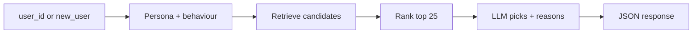

# Behavioral Recommendation Agent

Personalized **restaurant recommendations** for demo users: pick a user (or define a cold-start persona), and the API returns a ranked list of businesses with **scores** and **LLM-written reasons**. The pipeline combines deterministic behaviour profiles, **FAISS** retrieval, weighted candidate ranking, and an **OpenAI-compatible** chat model that must choose only from retrieved candidates.


---

## What you need

| Requirement | Notes |
|-------------|--------|
| **Python 3.12+** | See `.python-version`. |
| **[uv](https://docs.astral.sh/uv/)** | Installs locked deps from `uv.lock`. |
| **LLM API key** | OpenAI or any OpenAI-compatible provider (`AI_BASE_URL`). |
| **Docker** | `docker compose up --build`; see [README.Docker.md](README.Docker.md). |

---

## Quick start

### Docker

```bash
git clone https://github.com/EddyEjembi/Recommend-System.git
cd recommend-System

docker compose up --build
```

More detail: [README.Docker.md](README.Docker.md).


### **Start the API**

- Swagger: [http://localhost:9000/docs](http://localhost:9000/docs)
- ReDoc: [http://localhost:9000/redoc](http://localhost:9000/redoc)
- OpenAPI JSON: [http://localhost:9000/openapi.json](http://localhost:9000/openapi.json)

---

## Passing your OpenAI API key

### `POST /recommend`

The review endpoint requires an HTTP header:


```http
Authorization: Bearer <your_api_key>
```

**Fallback:** if no Bearer token is sent, the server uses `AI_API_KEY` or `OPENAI_API_KEY` from `.env`.

Optional `.env`:

```env
AI_API_KEY=sk-...
AI_MODEL=gpt-4o-mini
AI_BASE_URL=
```

- Empty `AI_MODEL` is ignored; default is `gpt-4o-mini`.
- Set `AI_BASE_URL` for OpenRouter, NVIDIA integrate, etc. (OpenAI-compatible `/v1`).

---

## API overview

| Method | Path | Auth | Purpose |
|--------|------|------|---------|
| `GET` | `/health/` | No | Liveness: `{"status":"ok"}`. |
| `GET` | `/health/ready` | No | Readiness stub. |
| `GET` | `/users` | No | List demo `user_id` values (`existing` + `cold_start`). |
| `GET` | `/new-user` | No | JSON Schema + example for `new_user` on `POST /recommend`. |
| `GET` | `/businesses` | No | Paginated businesses (`limit`, `offset`, optional `state`, `city`). |
| `POST` | `/recommend` | Bearer or env | Personalized recommendations (LLM agent). |

---

## `GET /users`

List registered demo users (no full persona blobs). Use a `user_id` with `POST /recommend`.

```bash
curl -s "http://localhost:9000/users"
```

---

## `GET /businesses`

Paginated rows from `businesses.parquet` (sort: state, city, business_id).

| Param | Default | Description |
|-------|---------|-------------|
| `limit` | `50` | Page size (max `200`). |
| `offset` | `0` | Skip rows. |
| `state` | — | Optional, e.g. `PA`. |
| `city` | — | Optional, e.g. `Philadelphia`. |

```bash
curl -s "http://localhost:9000/businesses?limit=10&offset=0"
```

---

## `GET /new-user`

Schema and example for the **`new_user`** object on `POST /recommend`.

```bash
curl -s "http://localhost:9000/new-user"
```

---

## `POST /recommend`

**Body (JSON)**

| Field | Required | Description |
|-------|----------|-------------|
| `user_id` | One of | Existing demo user from `GET /users`. Mutually exclusive with `new_user`. |
| `new_user` | One of | Cold-start seed; server creates `api_cold_*` id and registers behaviour. |
| `limit` | No | Number of recommendations (1–10). Default **5**. |

### cURL — existing user

```bash
curl -X POST 'http://localhost:9000/recommend' \
  -H 'accept: application/json' \
  -H 'Authorization: Bearer YOUR_API_KEY' \
  -H 'Content-Type: application/json' \
  -d '{
    "user_id": "USER_ID",
    "limit": 5
}'
```

### Example body — existing user

```json
{
  "user_id": "Hi10sGSZNxQH3NLyWSZ1oA",
  "limit": 5
}
```

### Example body — new cold-start user

```json
{
  "limit": 5,
  "new_user": {
    "archetype": "budget_foodie",
    "demographics": {
      "city": "Lagos",
      "country": "Nigeria",
      "age_band": "25-34",
      "language": "Nigerian English"
    },
    "preferences": {
      "budget": "low",
      "cuisines": ["Buka", "Local"],
      "tone": "warm",
      "review_style": "short, practical"
    },
    "service_expectations": {
      "wait_time_tolerance": "medium",
      "price_sensitivity": "high"
    },
    "notes": "Cares about portion size and value."
  }
}
```

### Response

```json
{
  "user_id": "Hi10sGSZNxQH3NLyWSZ1oA",
  "recommendations": [
    {
      "business_id": "Pns2l4eNsfO8kk83dixA6A",
      "business_name": "Example Kitchen",
      "score": 0.91,
      "reason": "Affordable meals and generous portions match your budget."
    }
  ]
}
```


## How it works



1. **Persona** — Loaded from `test_users.json` or built via LLM (warm: review history; cold: seed + similar users).
2. **Candidates** — Business vector search, similar reviews, similar users’ liked places; exclude already-reviewed businesses.
3. **Ranking** — Deterministic scores (semantic fit, price, categories, service themes, reputation) → shortlist of 25.
4. **LLM agent** — Picks the best `limit` businesses **only from that list** and writes `reason` for each (JSON mode).
5. **Validate** — Parser ensures every `business_id` was in the candidate pool.

---

## Rebuilding data

If you change the Yelp subset:

| Goal | Commands |
|------|----------|
| Shrink reviews only | `uv run python -m app.ingestion.trim_reviews --demo` then `uv run python -m app.retrieval.build_index --only reviews` |
| Full subset from raw JSON | `uv run python -m app.ingestion.build_subset` |
| Behaviour JSONL | `uv run python -m app.behavior.build_behavior` |
| All FAISS indices | `uv run python -m app.retrieval.build_index` |

After Parquet changes, regenerate **`user_behavior.jsonl`** and **`business_behavior.jsonl`** with `build_behavior`.

---

## Tests

```bash
uv run python -m pytest app/tests/ -v
```

Unit tests do not call the live LLM. Use Swagger or cURL for end-to-end checks.

---

